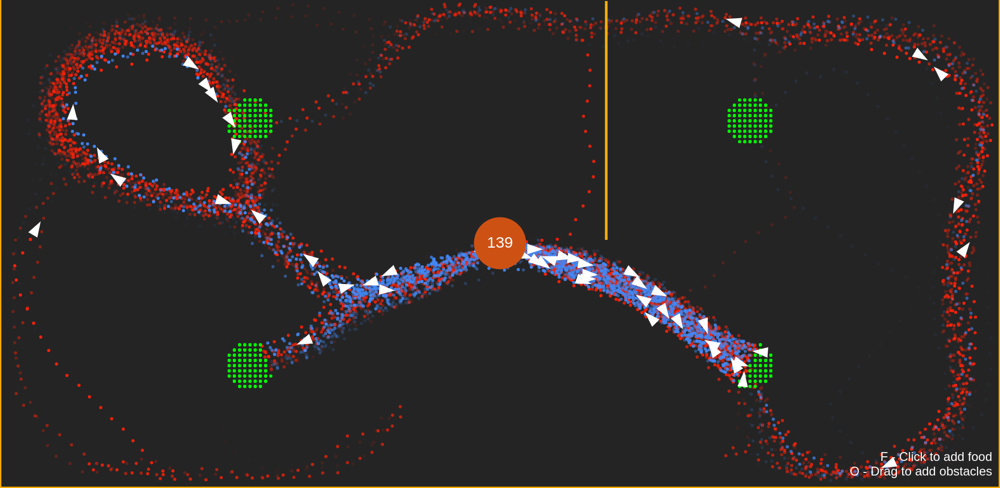

# Ant Simulation
A simulation of ant foraging with pheromones. 

[**Live Demo**](https://plebussupremus1234.github.io/Ant-Simulation)

## Sources & Credits
- [
Coding Adventure: Ant and Slime Simulations
](
https://www.youtube.com/watch?v=X-iSQQgOd1A
) by Sebastian Lague
- [
Computation of the Travelling Salesman
](https://arxiv.org/pdf/1303.4969.pdf) by Jeff Jones and Andrew Adamatzky
- [
Coding Challenge #98.1: Quadtree - Part 1
](https://www.youtube.com/watch?v=OJxEcs0w_kE) by Daniel Shiffman
- [
Coding Challenge #98.2: Quadtree - Part 2
](https://www.youtube.com/watch?v=QQx_NmCIuCY) by Daniel Shiffman
- [@KineticTactic](https://github.com/KineticTactic)